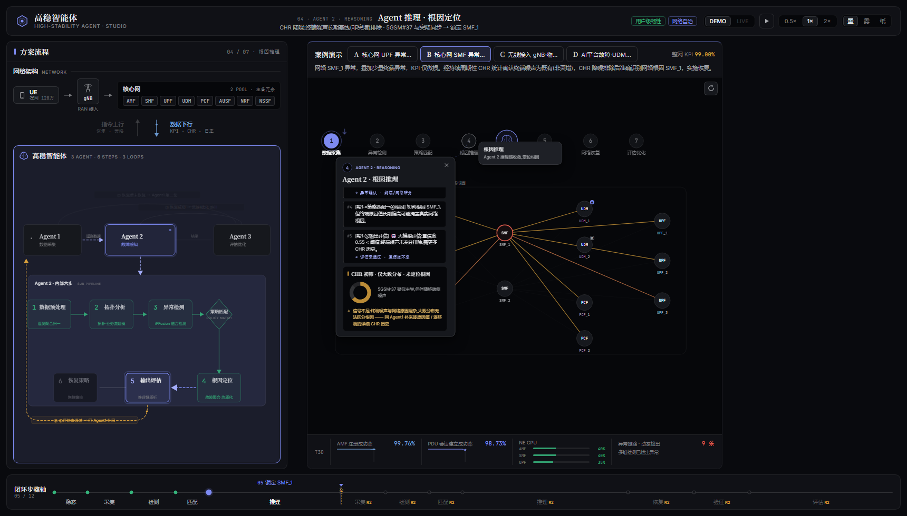
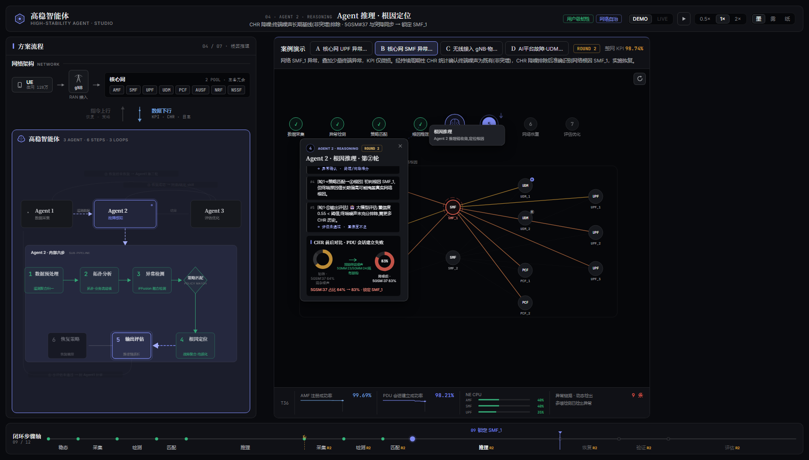

# frontend-flow-studio · 「静谧仪器」前端 —— 实现方案与案例运行效果

> 2026-08-17 交付。`frontend-flow-studio/` 是 `frontend-flow-demo/` 的完整拷贝(含当时工作区
> 未提交改动),经一次彻底的表现层重设计而成;**原目录未动,两套前端可并存对比**。
> 设计计划全文见 [`docs/plans/frontend-flow-studio-redesign.md`](plans/frontend-flow-studio-redesign.md)。

```bash
cd frontend-flow-studio && npm install && npm run dev   # 端口 5180
node scripts/verify.mjs                                  # 程序化验证(需 dev server 在跑)
```

---

## 一、设计立场:为什么这样改

旧版视觉是「深空 HUD 指挥中心」:霓虹青强调、辉光滤镜、网格暗角、扫描线、角标框、
全大写等宽标签、闪烁圆点、emoji 图标。这套语言的问题不是「不好看」,而是**廉价的多巴胺
堆叠** —— 高饱和、高闪烁、多彩色同时争夺注意力,恰好是「运维大屏」的模板脸。

Studio 版的设计立场(依据 2026-08 业界调研,Linear 官方 DESIGN.md 全文 + Vercel/Geist +
编辑排印趋势,详见计划文档 §2):

1. **墨色画布即留白** —— 近黑中性画布(微冷调 oklch),层次由**四阶表面阶梯 + 发丝线**承担,
   深色面板上**拒绝投影与辉光**(Linear 准则:depth is carried by surface ladder + hairline borders);
2. **一支强调色** —— 靛蓝墨水 `#7d8af2`(oklch 66% 0.15 277)只用于当前步骤、焦点、主交互;
   红/琥珀/绿是**数据语义**(故障/检出/恢复),永不作装饰;无第二彩色;
3. **衬线立骨,等宽立据** —— 标题用思源宋体(Noto Serif SC 可变字重,本地打包离线可用),
   一切测量值(KPI/CPU/公式/ID/时间)用 JetBrains Mono + `tabular-nums`;
   Inter 承担拉丁正文与数字。这是与「运维大屏」拉开距离的最强单品;
4. **动效即解释** —— 每个动画解释一次状态变化;全局循环动画只剩两个慢速项:
   数据流虚线漂移(2.2s)与呼吸描边(2.8s)。删除了全部 glow 滤镜、blink、扫描线、旋转环。

**反模式清单(已全部清除)**:辉光 / 扫描线 / 网格背景 / 暗角 / 闪烁 / 彩虹网元配色 /
全大写等宽标签滥用 / emoji 图标(全部换为几何 SVG 记号)/ 玻璃拟态卡片 / 双彩色强调。

### 设计令牌(摘要)

| 维度 | 方案 |
|---|---|
| 表面阶梯 | `--bg0` 画布 → `--bg1` 面板 → `--bg2` 悬浮/选中 → `--bg3` 浮层 → `--bg-inset` 内凹 |
| 发丝线 | `--line / --line-2 / --line-3`(白 7/12/19%;纸主题为墨色透明度) |
| 墨阶 | `--ink-1..5` 五级文字;标题 ink-1,正文 ink-2,辅助 ink-3/4,微标 ink-5 |
| 语义色 | ok `#35b57c` / warn `#d9a13c` / danger `#e05d4f` / info `#6f9fd8`(主题稳定) |
| 三主题 | **墨 ink**(默认)/ **雾 mist**(整体提亮,展会远观)/ **纸 paper**(暖白纸面) |
| 相位色 | 8 相位收敛为语义四色:稳态/恢复/评估=绿,智能体工作=靛蓝,检测/干预=琥珀,故障=红 |
| 排版 | 衬线 display 20/15px·600 · sans 正文 12.5/11px · mono 数据 12/22px + tabular-nums |
| 动效 | `--ease-out` cubic-bezier(0.22,1,0.36,1) + 140/240/420ms;浮层入场 rise |

所有令牌集中在 `src/styles/global.css`;与数据语义绑定、需拼接透明度的常量在 `src/theme.ts`。
结构与逻辑零改动:`story/`(时钟导演/LIVE 总线)、`data/`(场景契约)、`api/` 一行未动。

---

## 二、实现要点(按模块)

| 模块 | 改造 |
|---|---|
| `styles/global.css` | 全量重写:OKLCH 三主题令牌、`.panel/.seg/.btn/.tag/.fpop/.step-modal` 组件类、3 个 keyframes |
| `theme.ts` | 删 `NE_COLORS`(9 色网元)与 `GLOW`;`PHASES` 收敛语义四色;`STATUS` 精简 |
| `Shell/` | 三主题改 ink/mist/paper;TopBar 重排:品牌几何记号 + 衬线标题 + eyebrow,控件全部分段化 |
| `SolutionFlow/` | 面板化;NetworkStrip 网元改中性胶囊;Bridge 细线箭头(数据=钢蓝/指令=靛蓝);**AgentLoop SVG 全量重画**:去辉光滤镜,Agent 图标改几何记号(雷达弧/脑回线/对勾圆),步节点三态 = 发丝线/靛蓝+wash/绿描边 |
| `Guide/` | 场景条改安静标签;**GuideCanvas**:网元统一中性(表面+发丝线),状态才着色(故障=红呼吸环/根因=红虚线环/隔离=灰虚线框/过载=角标),采集线钢蓝细虚线、下发线靛蓝实线;7 圆圈 = 发丝线/绿勾/靛蓝实心;悬停 tooltip bg3 实底 |
| `Guide/StepModal` | surface-2 实底 + 发丝线 + 单层暗投影 + rise 入场;头部 mono 步号 + eyebrow + 衬线标题 |
| `Guide/PhasePanels` | 全部内容卡重构:内凹面卡片、衬线小节标题 + 语义色左标线(替代 emoji)、图表 1.4px 细线、阈值虚线加重、图例提对比;推理链改左竖线轨道 + 结论红标线 |
| `StepAxis/` | 「彩色格子墙」→ **轨道式进度**:发丝线轨道 + 刻度点(绿实心/靛蓝环/空心),当前步浮衬线标名 + 结论,轮次边界细虚线 ↻,播放头 1.5px 靛蓝垂线(rAF 直驱机制不变) |
| 死代码 | 删除 0-import 的 DigitalTwin / SkillLibrary / Timeline / shared(Gauge/HudFrame/Radar) / InfoPanel |
| 新增 | `public/favicon.svg`;App 深链 `?scenario=X&stop=N`(展会直达 + 自动化测试);`scripts/verify.mjs` |

字体三件套走 `@fontsource` 本地打包(`@fontsource-variable/noto-serif-sc` / `-inter` /
`@fontsource/jetbrains-mono`),**离线可用**;CJK 按 unicode-range 分包,浏览器只下载用到的子集。
构建产物:JS 385KB(gzip 130KB)+ 按需字体子集(每包 ~80KB)。

---

## 三、案例运行效果(程序化验证 + 截图)

验证脚本 `scripts/verify.mjs`(puppeteer-core + 本地 Chrome)对四个 DEMO 场景做了
**逐圆圈点击走查**,并验证字体加载、三主题切换与 LIVE 降级路径。结果:

```
fonts: { serif: true, inter: true, mono: true, loaded: 126 }   ← 三字体全部加载
scenario A: axisCount "01 / 08"  axisOk ✓ modals 7/7   ← 8 步长轴,7 圆圈全部可点开
scenario B: axisCount "01 / 12"  axisOk ✓ modals 7/7   ← 两轮场景 12 步
scenario C: axisCount "01 / 12"  axisOk ✓ modals 7/7
scenario D: axisCount "01 / 14"  axisOk ✓ modals 7/7   ← 两轮风暴场景 14 步
theme 墨/雾/纸: <html data-theme> 全部正确切换
live degrade: LIVE 按钮 disabled ✓ · 停留 DEMO ✓ · 无错误弹窗 ✓(无后端时)
==== VERIFY: PASS ====  (控制台零错误)
```

> 说明:原 `frontend-flow-demo` 的 DEMO 场景集为 **A/B/C/D 四个构造式场景**(A=UPF·确定性工作流,
> B=SMF·技能引导,C=gNB 物联终端·自主探索,D=AI 平台故障·UDM 过载·协同限流),
> 外加 **LIVE 模式**(A~G 七个后端真实闭环场景)。Studio 版将上述**全部**保留并验证可运行。

### 全景(墨主题 · 场景 A 稳态)


左:方案流程(网络架构 ↕ 双向桥 + 三 Agent 闭环图);右:引导舞台(场景标签 + 拓扑画布 +
7 步圆圈 + KPI 条);底:轨道式步骤轴。全屏无辉光、无网格、无大写等宽噪声。

### 场景 A · UPF 微损(8 步,置信度 0.76 → 确定性工作流)

| ② 异常检测 | ④ 根因推理 | ⑤ 策略下发 | ⑦ 评估优化 |
|---|---|---|---|
|  |  |  |  |

② 多路径 KPI 突降曲线(阈值虚线红色加重);④ 推理链左竖线轨道、结论步红标线「UPF_1 根因」;
⑤ 策略只下发根因网元 UPF_1(单线);⑦ 诊断 vs 真值命中 + 整网 KPI + Skill 判定,全 mono tabular。

### 场景 B · SMF + 终端噪声(12 步两轮,技能引导)

| ④ 第一轮 · 仅大致分布 · 未定位 | ④ 第二轮 · 补采后前后对比 → 根因 |
|---|---|
|  |  |

第一轮只检出 CHR 突增与大致分布(终端噪声混杂,琥珀提示回 Agent1 补采详细 CHR);
第二轮降噪前后对比:排除终端噪声 5GMM:23/24 后 5GSM#37 占比 64%→83% → 锁定 SMF_1。

⑦ 评估:更新 Skill「CHR 降噪 + 终端排除」,沉淀经验回流 Agent 1/2。


### 场景 C · 物联终端群体异常(12 步两轮,自主探索 + 误报拦截)


④ 推理链自主收敛;**CHR 前后对比环图**:左环「初筛 · 原因分散无主导」(灰),
经绿色箭头「共因聚类 · 剔除分散噪声」→ 右环红色主导段 52%,结论行
「聚类共因 gNB_2 物联终端 52% → 网络健康 · 用户侧异常」;
拓扑上 gNB_2 用户级告警、AMF_1 误报嫌疑标记(虚线环,相位≥3 后划掉拦截)。

### 场景 D · AI 平台故障 → UDM 过载(14 步两轮,最复杂)

| ② 异常检测(双曲线 + 三点过载) | ④ 根因推理(CHR/UFDR 溯源) | ⑤ 三策略并行下发 |
|---|---|---|
|  |  |  |

② AMF/SMF KPI+请求双曲线、UDM/AMF/SMF CPU 过载条;拓扑叠加左 UE 三分组(故障态红)
+ 右 AI 平台 1/2;④ CHR SST=3/DNN 占比 + UFDR SUPI 溯源到 AI 平台 1;
⑤ UE 回 T3346/T3396 + AMF 限 SST + SMF 限 DNN,公式行 mono 展示。

### 三主题

| 墨 ink(默认) | 雾 mist(展会远观) | 纸 paper(浅色) |
|---|---|---|
|  |  |  |

### 交互(与旧版完全一致)

- 点击圆圈 → `playUntil` 动画推进到该步 + 弹窗;`←/→` 步进;`Esc` 关弹窗;`↻` 重开;
- 顶栏播放/暂停、0.5/1/2× 变速、DEMO/LIVE 分段(无后端时禁用并提示)、墨/雾/纸主题;
- LIVE:capabilities 拉取失败/WS 断线 → 静默回 DEMO(已验证无崩溃、无错误弹窗);
- 深链:`http://localhost:5180/?scenario=D&stop=9` 直达场景 D 第 10 步(展会大屏可用)。

---

## 四、与 frontend-flow-demo 的关系

| | frontend-flow-demo | frontend-flow-studio |
|---|---|---|
| 视觉语言 | 深空 HUD 指挥中心(青/紫双色 + 辉光) | 静谧仪器(墨 + 靛蓝单强调 + 发丝线) |
| 排版 | 全大写等宽标签为主 | 衬线标题 + sans 正文 + mono 数据(离线打包字体) |
| 场景/逻辑 | A/B/C/D + LIVE | **完全相同(逐行未动)** |
| 主题 | 深邃/暮光/明亮 | 墨/雾/纸(OKLCH) |
| 死代码 | 7 个未引用组件 | 已删除 |
| 端口 | 5179 | 5180 |

两套前端共享同一后端(`uvicorn api.app:app --port 8000`,仅 LIVE 需要)。

## 五、v1.1 八项体验优化(2026-08-18)

| # | 优化 | 实现 |
|---|---|---|
| 1 | 左列 6 步流水线黑底突兀 | 流水线框与智能体大盒改**透明底 + 发丝虚线**,层次靠描边与提级 |
| 2 | 智能体内框小字小 | AgentLoop **整体放大**:Agent 盒 80→94 高、步节点 116×76→132×88,字号全面上调(标题 15→17.5、步名 14→16),弧线/回环标签同步重排 |
| 3 | 步骤轴看不到全貌 | 每步名称**常显**于刻度点下方(A=8/B=12/C=12/D=14 全名可见,R2 步带琥珀角标),当前步上方浮结论 |
| 4 | 弹窗看不到最新信息 | 模态内容体 **MutationObserver 钉底**:任何内容变化(推理链逐步揭示等)即滚到最下 |
| 5 | CHR 饼图缺前后对比 | 相位4 新增**双环对比**:初筛(混杂/分散,灰)→ 排除终端噪声 / 共因聚类(绿箭头标注)→ 降噪后(红主导段 + 中心占比),结论行给「xx% → yy% · 锁定根因」(B/C 场景) |
| 6 | 策略下发目标过散 | **只下发根因网元**:A→仅 UPF_1,B→仅 SMF_1,C→**AMF_1**(高稳智能体只能触达核心网,由 AMF 通知 gNB_2 换路),D 保持 AMF/SMF 协同限流 |
| 7 | 案例介绍位置 | 移到「案例演示」条**下方独立一行**(全宽,悬停看全文) |
| 8 | 精确/召回/F1 不展示 | 评估弹窗(DEMO+LIVE)移除 P/R/F1,改显**诊断 vs 真值命中** + 整网 KPI 恢复线 |

验证:`npm run build` ✓ + `node scripts/verify.mjs` 四场景全 PASS(后端在场时 LIVE 可点为正确行为,
脚本已环境自适应);#3/#4/#5/#6/#8 另做 DOM 断言与截图双确认。截图已全部按深链精确相位重拍。

---

## 六、v1.2 四项深化(2026-08-18 晚)

| # | 需求 | 实现 |
|---|---|---|
| 1 | B 第一轮只到「大致分布」,第二轮补采详细 CHR 才定位根因 | 相位④ 分轮:**第①轮 = 「CHR 初筛 · 仅大致分布 · 未定位根因」**(琥珀,单环大致分布 + 补采提示:回 Agent1 拉逐原因值/逐终端详细 CHR);**第②轮 = 前后对比双环 → 锁定 SMF_1**。相位② 同步分轮(「检出大致分布」/「补采详细分布」)。另修:**两轮场景点④圆圈不再倒回一轮**(DEMO 点击改为轮次感知,与 LIVE 分支对齐) |
| 2 | CHR/KPI 不用固定阈值 | 新模块 `Guide/anomaly.ts`:**因果滚动基线**(滚动中位数 μ + 鲁棒 σ̂=1.4826·MAD),动态界 μ±3·σ̂。KPI 图 = 浅色正常范围带 + 红虚线动态下界(截面中位数按**历史窗口**滞后跟随 → 故障突降时越界可见,持续后自适应);CHR 图 = 动态上界(替代固定 30%),突破即标「突破动态上界」。σ̂ 设下限 0.4%(KPI 域)防健康平线噪声误报。全部「阈值 99.5% / 30%」文案清除,改「动态下界 μ−3·σ̂」 |
| 3 | 多路径 KPI 全画出,用于均质化横向比较 | 相位② 新增**「实例 KPI · 均质化比较(横向)」卡**:A = AMF/SMF 实例组(全实例共性劣化 · 截面无离群 → 排除)+ UPF 实例组(**UPF_1 标红「· 离群」** → 根因方向);B = SMF(SMF_1 离群)+ AMF(正常);C = 全实例(无离群 → 网络侧健康)。离群判定即截面动态界的数学结果 —— 横向比较本身检测异常 |
| 4 | 整体按设计原则打磨 | 置信度放大至 26px mono、模式名衬线;推理链**结论步衬线加重**;文案全部改动态检测口径;新增 B 两轮对比截图 |

验证:`npm run build` ✓ · `verify.mjs` 四场景 PASS ✓ · DOM 断言:B轮1(初筛卡/无对比/补采提示)、B轮2(前后对比+「64%→83%·锁定 SMF_1」)、A相位2(均质化卡/动态下界/UPF_1 离群/无固定阈值)、C相位2(全量横向比较·**无误报离群**)、B相位2(动态上界)全部通过;视觉复核 B-r2 / A-anomaly 两张截图确认。

---

## 七、v1.3 五项微调(2026-08-18 夜)

| # | 需求 | 实现 |
|---|---|---|
| 1 | 内部 6 步要有小框(表 Agent2 子步骤) | 子步骤框回归:**极淡靛蓝洗底 + 发丝实线圆角框**(非旧黑色下沉底),框内左上「Agent 2 · 内部六步 · SUB-PIPELINE」标签;两轮徽标嵌框右上;A2→框顶连线 |
| 2 | 案例介绍显示不全 | 由单行省略改**两行留白**(-webkit-line-clamp:2,行高 1.6),悬停仍可看全文 |
| 3 | ⑤输出评估→Agent1 回环弧线优化 | 大弧线改**圆角肘形路径**(下落→左行→升入 A1 底部,三段 C 曲线圆滑转角),标签居中于水平段,不与步骤框/文字打架 |
| 4 | 弹窗不遮关键信息 | 定位打分新增**关键点惩罚**:根因 NE / 当前受影响 NE / 高稳智能体枢纽被盖记 2 分(圆圈仅 1 分)。实测 A/B/C 各相位根因节点与枢纽全部避开;D 拓扑过密时取最优位 |
| 5 | 全局巡检 | 小屏 1440×860 × 4 场景 × 20 停靠点 × 逐圆圈 140 次交互**零运行时错误**(scripts/sweep.mjs);四场景 verify PASS;视觉复核子步骤框/两行介绍/弧线/弹窗均达标 |

工具沉淀:`scripts/` 现有 `verify.mjs`(回归验证)/ `doc-shots.mjs`(按深链精确相位出文档截图)/ `sweep.mjs`(全场景交互巡检)。
