# frontend-flow-studio · 「静谧仪器」前端 —— 实现方案与案例运行效果

> 2026-08-17 交付。`frontend-flow-studio/` 是 `frontend-flow-demo/` 的完整拷贝(含当时工作区
> 未提交改动),经一次彻底的表现层重设计而成;**原目录未动,两套前端可并存对比**。
> 设计计划全文见 [`docs/plans/frontend-flow-studio-redesign.md`](plans/frontend-flow-studio-redesign.md)。

```bash
cd frontend-flow-studio && npm install && npm run dev   # 端口 5180
node scripts/verify.mjs                                  # 程序化验证(需 dev server 在跑)
```

---

## 一、设计立场:为什么这样改

旧版视觉是「深空 HUD 指挥中心」:霓虹青强调、辉光滤镜、网格暗角、扫描线、角标框、
全大写等宽标签、闪烁圆点、emoji 图标。这套语言的问题不是「不好看」,而是**廉价的多巴胺
堆叠** —— 高饱和、高闪烁、多彩色同时争夺注意力,恰好是「运维大屏」的模板脸。

Studio 版的设计立场(依据 2026-08 业界调研,Linear 官方 DESIGN.md 全文 + Vercel/Geist +
编辑排印趋势,详见计划文档 §2):

1. **墨色画布即留白** —— 近黑中性画布(微冷调 oklch),层次由**四阶表面阶梯 + 发丝线**承担,
   深色面板上**拒绝投影与辉光**(Linear 准则:depth is carried by surface ladder + hairline borders);
2. **一支强调色** —— 靛蓝墨水 `#7d8af2`(oklch 66% 0.15 277)只用于当前步骤、焦点、主交互;
   红/琥珀/绿是**数据语义**(故障/检出/恢复),永不作装饰;无第二彩色;
3. **衬线立骨,等宽立据** —— 标题用思源宋体(Noto Serif SC 可变字重,本地打包离线可用),
   一切测量值(KPI/CPU/公式/ID/时间)用 JetBrains Mono + `tabular-nums`;
   Inter 承担拉丁正文与数字。这是与「运维大屏」拉开距离的最强单品;
4. **动效即解释** —— 每个动画解释一次状态变化;全局循环动画只剩两个慢速项:
   数据流虚线漂移(2.2s)与呼吸描边(2.8s)。删除了全部 glow 滤镜、blink、扫描线、旋转环。

**反模式清单(已全部清除)**:辉光 / 扫描线 / 网格背景 / 暗角 / 闪烁 / 彩虹网元配色 /
全大写等宽标签滥用 / emoji 图标(全部换为几何 SVG 记号)/ 玻璃拟态卡片 / 双彩色强调。

### 设计令牌(摘要)

| 维度 | 方案 |
|---|---|
| 表面阶梯 | `--bg0` 画布 → `--bg1` 面板 → `--bg2` 悬浮/选中 → `--bg3` 浮层 → `--bg-inset` 内凹 |
| 发丝线 | `--line / --line-2 / --line-3`(白 7/12/19%;纸主题为墨色透明度) |
| 墨阶 | `--ink-1..5` 五级文字;标题 ink-1,正文 ink-2,辅助 ink-3/4,微标 ink-5 |
| 语义色 | ok `#35b57c` / warn `#d9a13c` / danger `#e05d4f` / info `#6f9fd8`(主题稳定) |
| 三主题 | **墨 ink**(默认)/ **雾 mist**(整体提亮,展会远观)/ **纸 paper**(暖白纸面) |
| 相位色 | 8 相位收敛为语义四色:稳态/恢复/评估=绿,智能体工作=靛蓝,检测/干预=琥珀,故障=红 |
| 排版 | 衬线 display 20/15px·600 · sans 正文 12.5/11px · mono 数据 12/22px + tabular-nums |
| 动效 | `--ease-out` cubic-bezier(0.22,1,0.36,1) + 140/240/420ms;浮层入场 rise |

所有令牌集中在 `src/styles/global.css`;与数据语义绑定、需拼接透明度的常量在 `src/theme.ts`。
结构与逻辑零改动:`story/`(时钟导演/LIVE 总线)、`data/`(场景契约)、`api/` 一行未动。

---

## 二、实现要点(按模块)

| 模块 | 改造 |
|---|---|
| `styles/global.css` | 全量重写:OKLCH 三主题令牌、`.panel/.seg/.btn/.tag/.fpop/.step-modal` 组件类、3 个 keyframes |
| `theme.ts` | 删 `NE_COLORS`(9 色网元)与 `GLOW`;`PHASES` 收敛语义四色;`STATUS` 精简 |
| `Shell/` | 三主题改 ink/mist/paper;TopBar 重排:品牌几何记号 + 衬线标题 + eyebrow,控件全部分段化 |
| `SolutionFlow/` | 面板化;NetworkStrip 网元改中性胶囊;Bridge 细线箭头(数据=钢蓝/指令=靛蓝);**AgentLoop SVG 全量重画**:去辉光滤镜,Agent 图标改几何记号(雷达弧/脑回线/对勾圆),步节点三态 = 发丝线/靛蓝+wash/绿描边 |
| `Guide/` | 场景条改安静标签;**GuideCanvas**:网元统一中性(表面+发丝线),状态才着色(故障=红呼吸环/根因=红虚线环/隔离=灰虚线框/过载=角标),采集线钢蓝细虚线、下发线靛蓝实线;7 圆圈 = 发丝线/绿勾/靛蓝实心;悬停 tooltip bg3 实底 |
| `Guide/StepModal` | surface-2 实底 + 发丝线 + 单层暗投影 + rise 入场;头部 mono 步号 + eyebrow + 衬线标题 |
| `Guide/PhasePanels` | 全部内容卡重构:内凹面卡片、衬线小节标题 + 语义色左标线(替代 emoji)、图表 1.4px 细线、阈值虚线加重、图例提对比;推理链改左竖线轨道 + 结论红标线 |
| `StepAxis/` | 「彩色格子墙」→ **轨道式进度**:发丝线轨道 + 刻度点(绿实心/靛蓝环/空心),当前步浮衬线标名 + 结论,轮次边界细虚线 ↻,播放头 1.5px 靛蓝垂线(rAF 直驱机制不变) |
| 死代码 | 删除 0-import 的 DigitalTwin / SkillLibrary / Timeline / shared(Gauge/HudFrame/Radar) / InfoPanel |
| 新增 | `public/favicon.svg`;App 深链 `?scenario=X&stop=N`(展会直达 + 自动化测试);`scripts/verify.mjs` |

字体三件套走 `@fontsource` 本地打包(`@fontsource-variable/noto-serif-sc` / `-inter` /
`@fontsource/jetbrains-mono`),**离线可用**;CJK 按 unicode-range 分包,浏览器只下载用到的子集。
构建产物:JS 385KB(gzip 130KB)+ 按需字体子集(每包 ~80KB)。

---

## 三、案例运行效果(程序化验证 + 截图)

验证脚本 `scripts/verify.mjs`(puppeteer-core + 本地 Chrome)对四个 DEMO 场景做了
**逐圆圈点击走查**,并验证字体加载、三主题切换与 LIVE 降级路径。结果:

```
fonts: { serif: true, inter: true, mono: true, loaded: 126 }   ← 三字体全部加载
scenario A: axisCount "01 / 08"  axisOk ✓ modals 7/7   ← 8 步长轴,7 圆圈全部可点开
scenario B: axisCount "01 / 12"  axisOk ✓ modals 7/7   ← 两轮场景 12 步
scenario C: axisCount "01 / 12"  axisOk ✓ modals 7/7
scenario D: axisCount "01 / 14"  axisOk ✓ modals 7/7   ← 两轮风暴场景 14 步
theme 墨/雾/纸: <html data-theme> 全部正确切换
live degrade: LIVE 按钮 disabled ✓ · 停留 DEMO ✓ · 无错误弹窗 ✓(无后端时)
==== VERIFY: PASS ====  (控制台零错误)
```

> 说明:原 `frontend-flow-demo` 的 DEMO 场景集为 **A/B/C/D 四个构造式场景**(A=UPF·确定性工作流,
> B=SMF·技能引导,C=gNB 物联终端·自主探索,D=AI 平台故障·UDM 过载·协同限流),
> 外加 **LIVE 模式**(A~G 七个后端真实闭环场景)。Studio 版将上述**全部**保留并验证可运行。

### 全景(墨主题 · 场景 A 稳态)

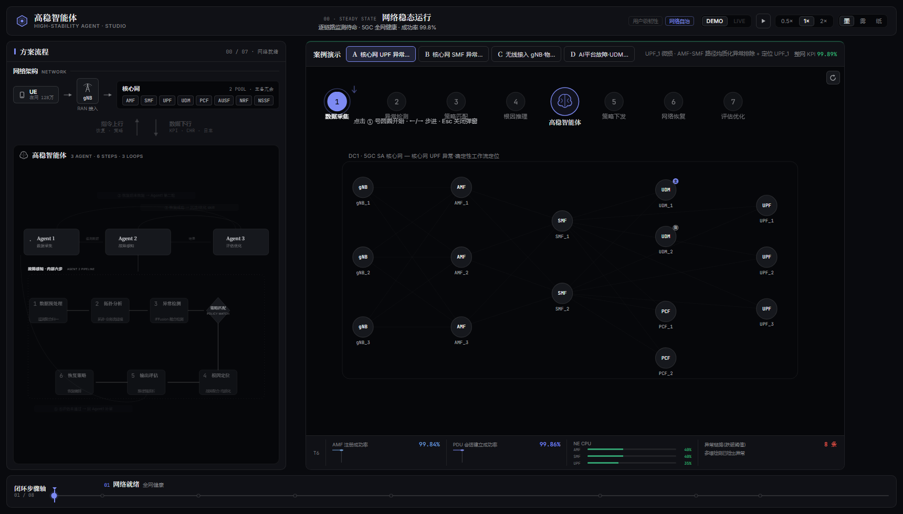

左:方案流程(网络架构 ↕ 双向桥 + 三 Agent 闭环图);右:引导舞台(场景标签 + 拓扑画布 +
7 步圆圈 + KPI 条);底:轨道式步骤轴。全屏无辉光、无网格、无大写等宽噪声。

### 场景 A · UPF 微损(8 步,置信度 0.76 → 确定性工作流)

| ② 异常检测 | ④ 根因推理 | ⑤ 策略下发 | ⑦ 评估优化 |
|---|---|---|---|
| 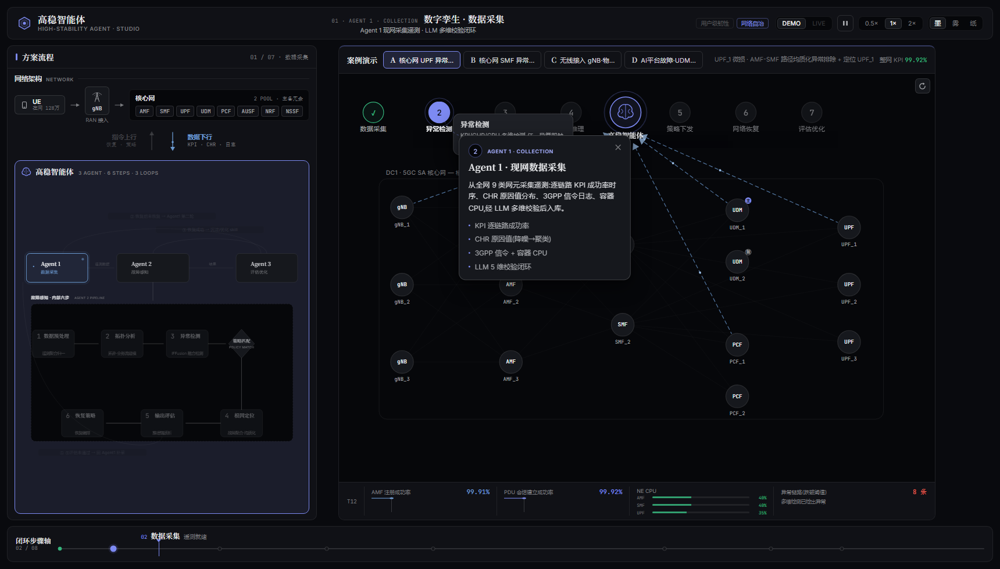 | 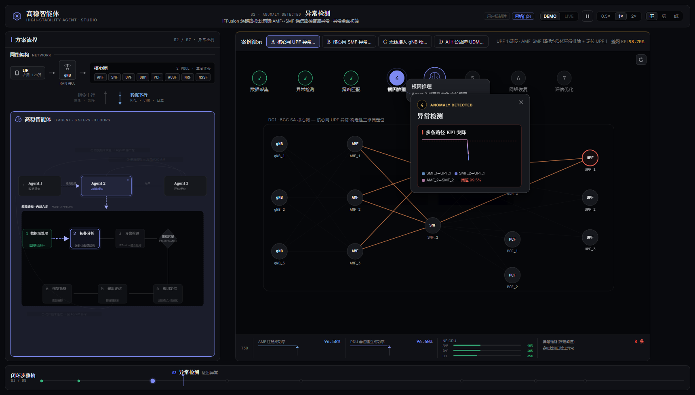 | 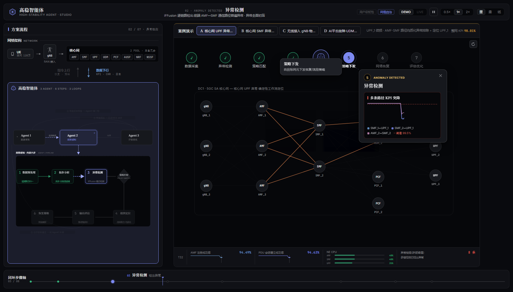 | 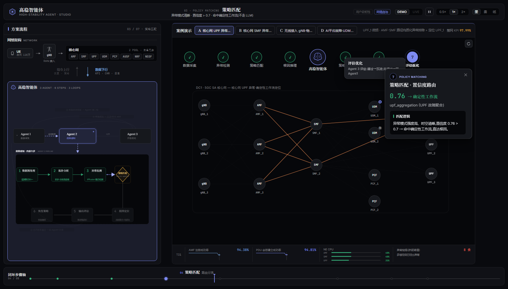 |

② 多路径 KPI 突降曲线(阈值虚线红色加重);④ 推理链左竖线轨道、结论步红标线「UPF_1 根因」;
⑤ 隔离 UPF_1 + 切换 POOL;⑦ P/R/F1 指标行 + Skill 判定,全 mono tabular。

### 场景 B · SMF + 终端噪声(12 步两轮,技能引导)

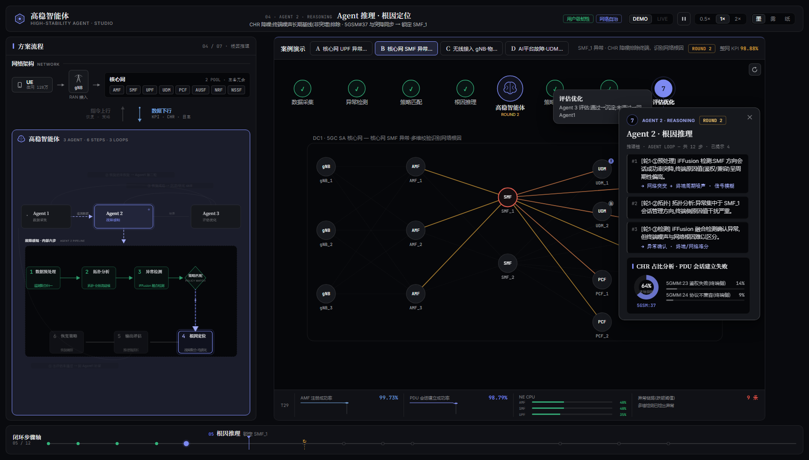

⑦ 评估:更新 Skill「CHR 降噪 + 终端排除」,沉淀经验回流 Agent 1/2。

### 场景 C · 物联终端群体异常(12 步两轮,自主探索 + 误报拦截)

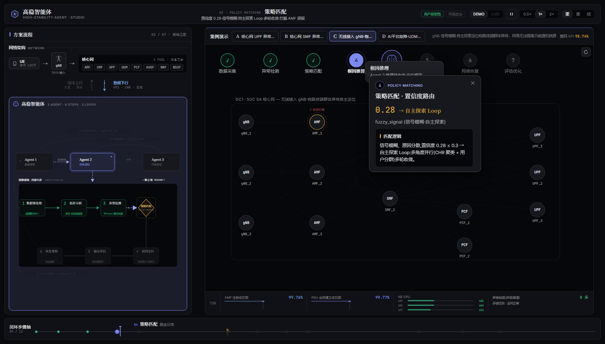

④ 推理链自主收敛至「物联终端群体 52% 失败 · 网络健康」;拓扑上 gNB_2 用户级告警、
AMF_1 误报嫌疑标记(虚线环,相位≥3 后划掉拦截)。

### 场景 D · AI 平台故障 → UDM 过载(14 步两轮,最复杂)

| ② 异常检测(双曲线 + 三点过载) | ④ 根因推理(CHR/UFDR 溯源) | ⑤ 三策略并行下发 |
|---|---|---|
| 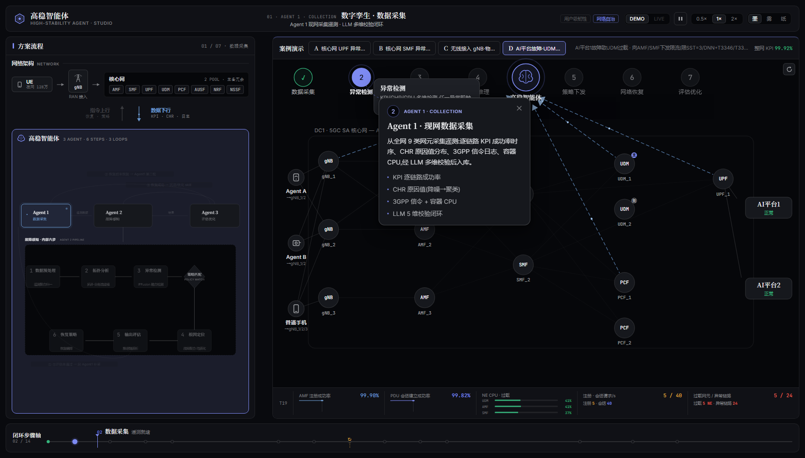 | 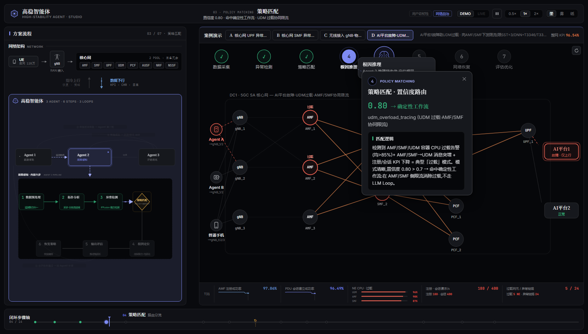 | 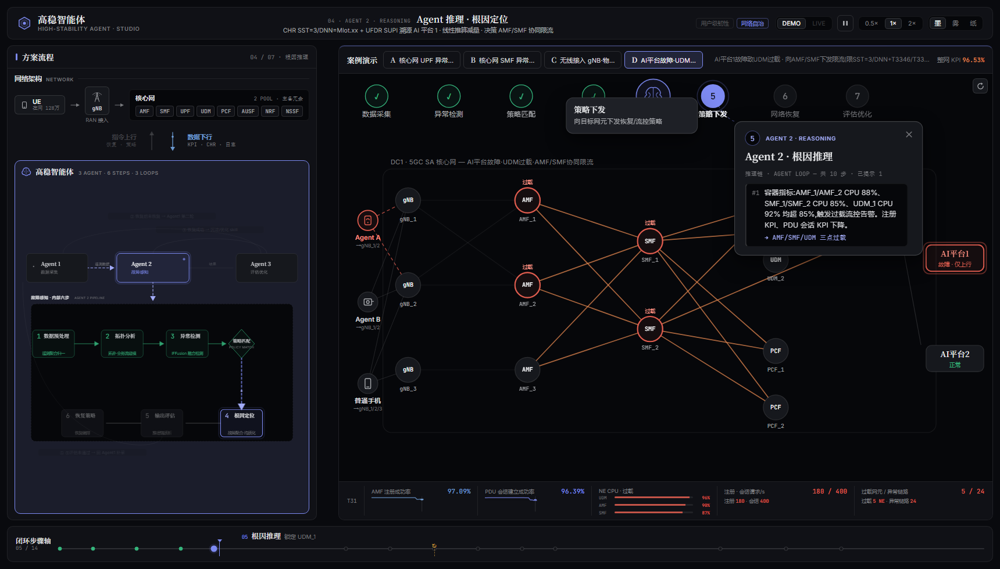 |

② AMF/SMF KPI+请求双曲线、UDM/AMF/SMF CPU 过载条;拓扑叠加左 UE 三分组(故障态红)
+ 右 AI 平台 1/2;④ CHR SST=3/DNN 占比 + UFDR SUPI 溯源到 AI 平台 1;
⑤ UE 回 T3346/T3396 + AMF 限 SST + SMF 限 DNN,公式行 mono 展示。

### 三主题

| 墨 ink(默认) | 雾 mist(展会远观) | 纸 paper(浅色) |
|---|---|---|
| 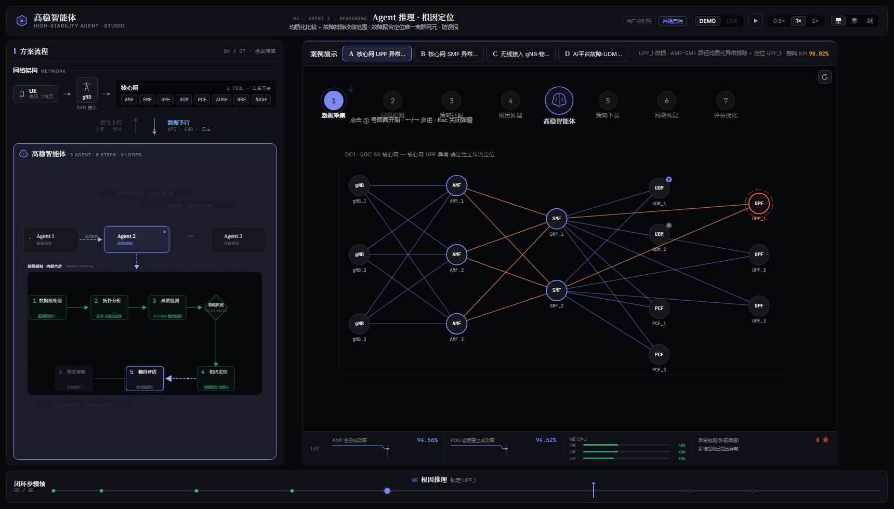 | 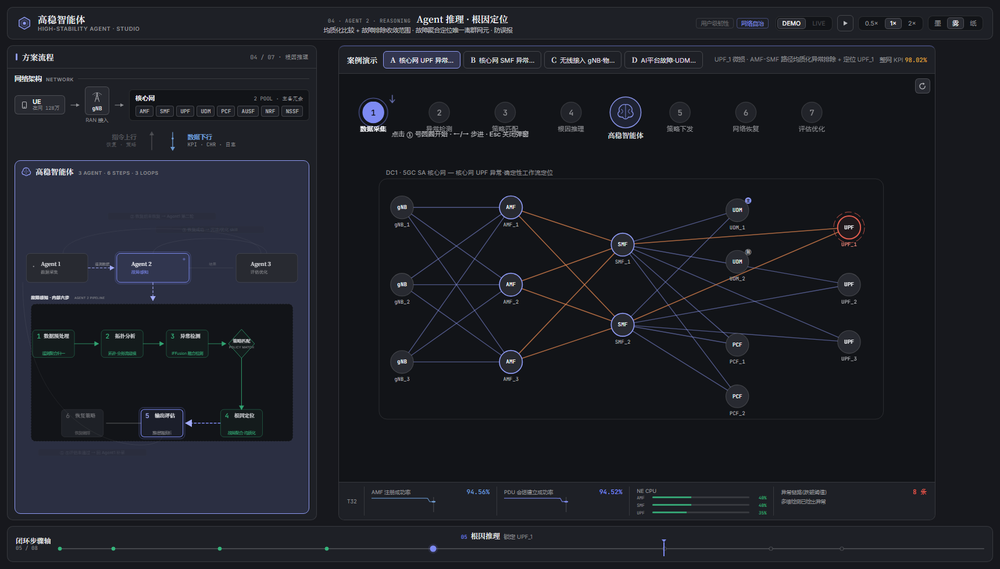 | 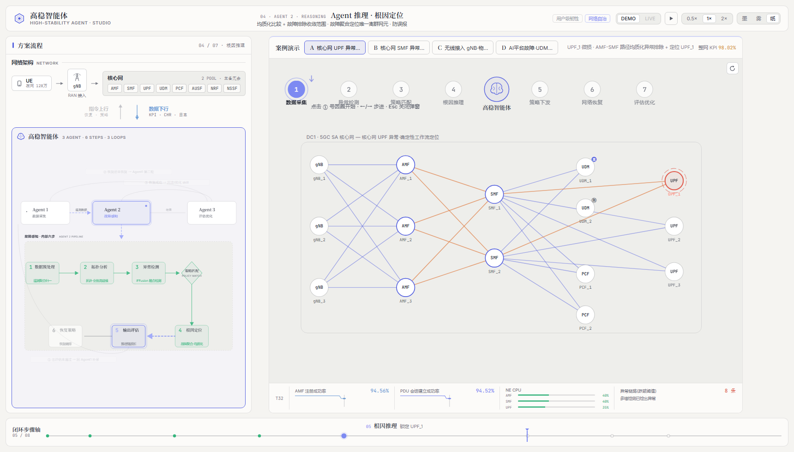 |

### 交互(与旧版完全一致)

- 点击圆圈 → `playUntil` 动画推进到该步 + 弹窗;`←/→` 步进;`Esc` 关弹窗;`↻` 重开;
- 顶栏播放/暂停、0.5/1/2× 变速、DEMO/LIVE 分段(无后端时禁用并提示)、墨/雾/纸主题;
- LIVE:capabilities 拉取失败/WS 断线 → 静默回 DEMO(已验证无崩溃、无错误弹窗);
- 深链:`http://localhost:5180/?scenario=D&stop=9` 直达场景 D 第 10 步(展会大屏可用)。

---

## 四、与 frontend-flow-demo 的关系

| | frontend-flow-demo | frontend-flow-studio |
|---|---|---|
| 视觉语言 | 深空 HUD 指挥中心(青/紫双色 + 辉光) | 静谧仪器(墨 + 靛蓝单强调 + 发丝线) |
| 排版 | 全大写等宽标签为主 | 衬线标题 + sans 正文 + mono 数据(离线打包字体) |
| 场景/逻辑 | A/B/C/D + LIVE | **完全相同(逐行未动)** |
| 主题 | 深邃/暮光/明亮 | 墨/雾/纸(OKLCH) |
| 死代码 | 7 个未引用组件 | 已删除 |
| 端口 | 5179 | 5180 |

两套前端共享同一后端(`uvicorn api.app:app --port 8000`,仅 LIVE 需要)。
